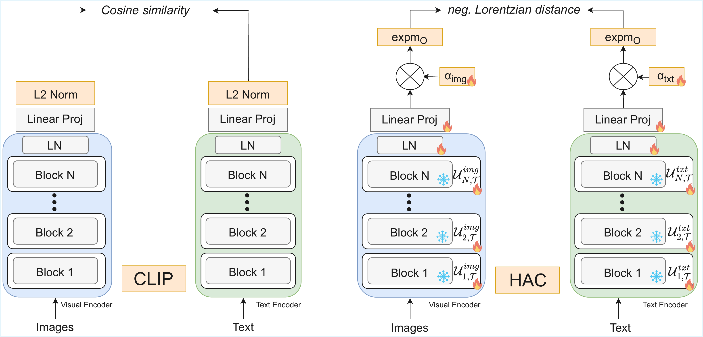

# HAC: Parameter-Efficient Hyperbolic Adaptation of CLIP for Zero-Shot VQA

**Published at ICPR 2026**

**This codebase builds upon [MERU](https://github.com/facebookresearch/meru) and [HyCoCLIP](https://github.com/PalAvik/hycoclip).**

<p align="center"></p>

## Environment Setup

Create and configure the environment using [Conda](https://conda.io/docs/user-guide/install/download.html):

```bash
git clone git@github.com:fdibiton/HAC.git
cd HAC
conda create -n hac python=3.9 --yes
conda activate hac
```

Install PyTorch and torchvision by following the official guide at [pytorch.org](https://pytorch.org). Then install the remaining dependencies and package:

```bash
python -m pip install --pre timm
python -m pip install -r requirements.txt
```

## Pre-trained Models

The **HAC-B w/ LoRA** checkpoint is hosted on Hugging Face and can be downloaded from [here](https://huggingface.co/fdibiton/HAC/blob/main/hac_vit_b_lora.pth). Place the downloaded file in the `./checkpoints` directory.

## Evaluation

To run zero-shot VQA evaluation with the HAC-B w/ LoRA model:

```bash
python scripts/evaluate.py \
    --config configs/eval_vqa_all_categories.py \
    --train-config configs/train_hac_vit_b_lora.py \
    --checkpoint-path checkpoints/hac_vit_b_lora.pth
```

> **Note:** The VQA evaluation datasets need to be downloaded and arranged beforehand. Please refer to the instructions in [`scripts/vqa/README.md`](./scripts/vqa/README.md) for details on how to obtain and set up the required datasets.

## Training

### Preparing Training Data — GRIT

The GRIT dataset is required for training. Download the raw GRIT data in webdataset format and pre-process it to extract bounding box annotations. For detailed download and preparation steps, refer to the [HyCoCLIP repository](https://github.com/PalAvik/hycoclip).

### Running a Training

To train the HAC-B w/ LoRA model:

```bash
python scripts/train.py \
    --config configs/train_hac_vit_b_lora.py \
    --num-gpus 1 \
    --output-dir <your_output_directory> \
    --checkpoint-period 100000 \
    --log-period 10
```
Note: You need Euclidean CLIP checkpoint to initialize the model. You can download the ViT-B/16 checkpoint from the [HyCoCLIP repository](https://github.com/PalAvik/hycoclip/blob/main/model-zoo.md).

## Citation

If you find this work useful, please cite:

```bibtex
@inproceedings{dibiton2026hac,
    title={HAC: Parameter-Efficient Hyperbolic Adaptation of CLIP for Zero-Shot VQA},
    author={Dibitonto, Francesco and Beyan, Cigdem and Murino, Vittorio},
    booktitle={International Conference on Pattern Recognition (ICPR)},
    year={2026}
}
```
